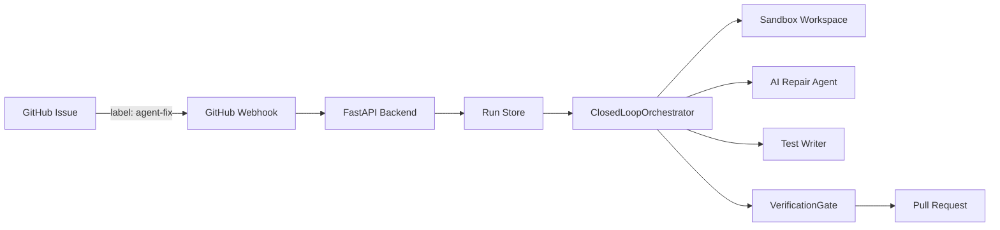

<div align="center">
  
  <h1>Self-Healing Bug Agent</h1>
  <p><strong>Autonomous bug detection, repair, and verification for GitHub repositories</strong></p>
  <p>
    <a href="#features">Features</a> ·
    <a href="#architecture">Architecture</a> ·
    <a href="#quickstart">Quickstart</a> ·
    <a href="#github">GitHub</a>
  </p>
  
  
  
  
</div>

## Overview

The Self-Healing Bug Agent is a closed-loop backend that receives a bug report or failed GitHub Actions run, reproduces the failure in a workspace, iterates on a fix, adds a regression test, runs targeted and full verification, and only then allows a pull request to open.

<div align="center">
  
</div>

## Features

| Feature | Description |
|---------|-------------|
| 🚀 **Autonomous Patching** | AI analyzes issues and generates production-ready code fixes. |
| 🛡️ **Sandbox Verification** | Patches are tested in isolated environments before deployment. |
| 🧪 **Regression Testing** | Automatically adds regression tests to prevent future breaks. |
| 🐙 **GitHub Integration** | Seamlessly works with your existing GitHub repos and PRs. |
| ⚡ **Lightning Fast** | End-to-end workflow that runs in minutes, not hours. |
| ✅ **Verified PRs** | Only opens PRs with fully passing test suites. |

## Architecture

### Core Principles

- The model may propose a diagnosis, patch, or test. It cannot declare itself green.
- Only deterministic command results assembled into `VerificationReport` can move a run to `ready_for_pr`.
- Only the `ready_for_pr` state may invoke the PR publisher.

### System Flow

<div align="center">


</div>

### Project Structure

```
.
├── ai-repair-dashboard/        # Frontend (React + TypeScript)
│   ├── src/
│   │   ├── components/
│   │   ├── routes/
│   │   └── lib/
│   └── package.json
├── self-healing-bug-agent/     # Backend (FastAPI + Python)
│   ├── src/healing_agent/
│   │   ├── api/
│   │   ├── integrations/
│   │   ├── modules/
│   │   ├── orchestrator/
│   │   └── app.py
│   ├── tests/
│   └── pyproject.toml
└── module3_sandbox_verification/  # Sandbox & Verification module
    └── src/healing_agent/modules/sandbox_verification/
```

## Quickstart

### Prerequisites

- Python 3.11+
- Node.js 20+
- npm or yarn
- Docker and Docker Compose (optional)

### Option 1: Quick Start with Docker Compose

```bash
cd self-healing-bug-agent
docker compose up
```

Backend will be at http://localhost:8000
Frontend will be at http://localhost:8080

### Option 2: Manual Setup

#### Backend Setup

```bash
cd self-healing-bug-agent
python -m venv .venv
# Windows
.\.venv\Scripts\activate
# Linux/macOS
source .venv/bin/activate
pip install -e '.[dev]'
cp .env.example .env
uvicorn healing_agent.app:app --reload --port 8000
```

The backend will be running at [http://127.0.0.1:8000](http://127.0.0.1:8000). You can find the API docs at [http://127.0.0.1:8000/docs](http://127.0.0.1:8000/docs).

#### Frontend Setup

```bash
cd ai-repair-dashboard
npm install
npm run dev
```

The frontend will be running at [http://localhost:8080](http://localhost:8080).

## API Reference

### Base URL
- Development: `http://localhost:8000`
- Production: Set via `VITE_API_URL` for frontend

### Endpoints

| Method | Path | Purpose |
|--------|------|---------|
| `GET` | `/health` | Service health |
| `POST` | `/api/v1/runs` | Create a manual repair run |
| `GET` | `/api/v1/runs` | List repair runs |
| `GET` | `/api/v1/runs/{id}` | Inspect state and timeline |
| `POST` | `/webhooks/github` | Receive signed GitHub events |

### Example Requests

```bash
# Health check
curl http://localhost:8000/health

# Create a repair run
curl -X POST http://localhost:8000/api/v1/runs \
  -H "Content-Type: application/json" \
  -d '{
    "repo_full_name": "owner/repo",
    "base_sha": "abc1234",
    "bug_report": "Null pointer exception in user service",
    "trigger_type": "manual"
  }'

# List all runs
curl http://localhost:8000/api/v1/runs

# Get specific run
curl http://localhost:8000/api/v1/runs/{run-id}
```

## Testing

### Running Tests

#### Backend Tests

```bash
cd self-healing-bug-agent
pytest tests/
```

#### Frontend Build

```bash
cd ai-repair-dashboard
npm run build
npm run preview
```

### Manual Testing Workflow

1. Start backend and frontend:
   ```bash
   # Terminal 1 - Backend
   cd self-healing-bug-agent
   uvicorn healing_agent.app:app --reload --port 8000
   
   # Terminal 2 - Frontend
   cd ai-repair-dashboard
   npm run dev
   ```

2. Verify backend health:
   ```bash
   curl http://localhost:8000/health
   # Expected: {"status":"ok"}
   ```

3. Open frontend: http://localhost:8080

4. Create a repair run using the API or dashboard

5. Monitor run status:
   ```bash
   curl http://localhost:8000/api/v1/runs
   ```

### Test Coverage

- Backend: pytest-based unit tests for state machine, webhook verification, and API endpoints
- Frontend: Vite build validates TypeScript and component compilation
- Integration: Full end-to-end verification from API request to run completion

## Deployment

### Backend Deployment

#### Railway / Render / Fly.io

```bash
# Install Railway CLI
npm i -g @railway/cli
railway login
railway init
railway up
```

Environment variables:
- `APP_ENV=production`
- `OPENAI_API_KEY=your-key`
- `GITHUB_WEBHOOK_SECRET=your-secret`
- `GITHUB_APP_ID=your-app-id`
- `GITHUB_PRIVATE_KEY_PATH=/path/to/key.pem`
- `MAX_REPAIR_ITERATIONS=3`
- `WORKSPACE_ROOT=/tmp/workspaces`

#### Docker

```bash
cd self-healing-bug-agent
docker build -t self-healing-bug-agent .
docker run -p 8000:8000 \
  -e APP_ENV=production \
  -e OPENAI_API_KEY=your-key \
  self-healing-bug-agent
```

### Frontend Deployment

#### Vercel / Netlify

```bash
cd ai-repair-dashboard
npm run build

# Vercel
vercel --prod

# Netlify
netlify deploy --prod
```

Set environment variables:
- `VITE_API_URL=https://your-backend-url.com`

## Architecture

### Backend (FastAPI + Python)

- **State Machine**: Explicit, auditable repair state machine.
- **Pluggable Modules**: Contracts for workspace, reproduction, repair, test writing, verification, and PR publishing.
- **Verification Gate**: Hard gate that prevents unverified PRs.
- **Async Workers**: Background task execution for repair workflows.
- **Testing**: Automated tests for green loop, retry loop, iteration limit, webhook signature, etc.

### Frontend (React + TypeScript)

- **File-Based Routing**: Using TanStack Router for clean routing.
- **API Client**: Direct fetch with TypeScript interfaces.
- **Styling**: Tailwind CSS with a professional, minimal OpenAI-style theme.
- **Animations**: Framer Motion for smooth, modern animations.

## Codex Usage

### Important Tasks Where Codex Contributed

#### 1. Backend Bug Fix - Scope Issue in app.py

**Problem**: The `execute_workflow` function referenced the global `app` variable, creating a fragile dependency on module-level state during async execution.

**Prompt**: "Fix bug in app.py where execute_workflow uses app.state before app is created"

**Codex Contribution**: Refactored `execute_workflow` to accept `orchestrator` and `store` as explicit parameters, eliminating the fragile closure over `app.state`.

**Developer Decisions**:
- Maintained async task creation pattern
- Kept existing error handling and event logging
- Ensured backward compatibility with existing API

**Final Implementation**: 
```python
async def execute_workflow(
    run: RepairRun,
    orchestrator: ClosedLoopOrchestrator,
    store: InMemoryRunStore,
) -> None:
    try:
        updated_run = await orchestrator.execute(run)
        store.save(updated_run)
    except Exception as e:
        run.add_event(...)
        store.save(run)
```

#### 2. CORS Configuration

**Problem**: Frontend running on port 8080 was not included in CORS origins.

**Prompt**: "Update CORS to include localhost:8080"

**Codex Contribution**: Added `http://localhost:8080` to the `allow_origins` list in CORSMiddleware configuration.

**Developer Decisions**:
- Included all common development ports (5173, 8080, 8082, 8081)
- Maintained allow_credentials=True for session support

**Final Implementation**: CORS origins now include all frontend dev server ports.

## License

[MIT](https://choosealicense.com/licenses/mit/)

---

<div align="center">
  Built with ❤️ for the OpenAI Hackathon.
</div>
