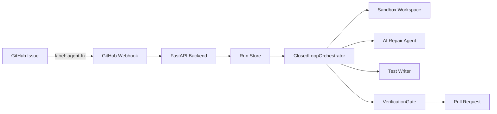

<div align="center">
  
  <h1>Self-Healing Bug Agent</h1>
  <p><strong>Autonomous bug detection, repair, and verification for GitHub repositories</strong></p>
  <p>
    <a href="#features">Features</a> ·
    <a href="#architecture">Architecture</a> ·
    <a href="#quickstart">Quickstart</a> ·
    <a href="#github">GitHub</a>
  </p>
  
  
  
  
</div>

## Overview

The Self-Healing Bug Agent is a closed-loop backend that receives a bug report or failed GitHub Actions run, reproduces the failure in a workspace, iterates on a fix, adds a regression test, runs targeted and full verification, and only then allows a pull request to open.

<div align="center">
  
</div>

## Features

| Feature | Description |
|---------|-------------|
| 🚀 **Autonomous Patching** | AI analyzes issues and generates production-ready code fixes. |
| 🛡️ **Sandbox Verification** | Patches are tested in isolated environments before deployment. |
| 🧪 **Regression Testing** | Automatically adds regression tests to prevent future breaks. |
| 🐙 **GitHub Integration** | Seamlessly works with your existing GitHub repos and PRs. |
| ⚡ **Lightning Fast** | End-to-end workflow that runs in minutes, not hours. |
| ✅ **Verified PRs** | Only opens PRs with fully passing test suites. |

## Architecture

### Core Principles

- The model may propose a diagnosis, patch, or test. It cannot declare itself green.
- Only deterministic command results assembled into `VerificationReport` can move a run to `ready_for_pr`.
- Only the `ready_for_pr` state may invoke the PR publisher.

### System Flow

<div align="center">


</div>

### Project Structure

```
.
├── ai-repair-dashboard/        # Frontend (React + TypeScript)
│   ├── src/
│   │   ├── components/
│   │   ├── routes/
│   │   └── lib/
│   └── package.json
├── self-healing-bug-agent/     # Backend (FastAPI + Python)
│   ├── src/healing_agent/
│   │   ├── api/
│   │   ├── integrations/
│   │   ├── modules/
│   │   ├── orchestrator/
│   │   └── app.py
│   ├── tests/
│   └── pyproject.toml
└── module3_sandbox_verification/  # Sandbox & Verification module
    └── src/healing_agent/modules/sandbox_verification/
```

## Quickstart

### Prerequisites

- Python 3.11+
- Node.js 20+
- npm or yarn

### Backend Setup

```bash
cd self-healing-bug-agent
python -m venv .venv
# Windows
.\.venv\Scripts\activate
# Linux/macOS
source .venv/bin/activate
pip install -e '.[dev]'
cp .env.example .env
uvicorn healing_agent.app:app --reload --port 8000
```

The backend will be running at [http://127.0.0.1:8000](http://127.0.0.1:8000). You can find the API docs at [http://127.0.0.1:8000/docs](http://127.0.0.1:8000/docs).

### Frontend Setup

```bash
cd ai-repair-dashboard
npm install
npm run dev
```

The frontend will be running at [http://localhost:8082](http://localhost:8082).

## API Reference

| Method | Path | Purpose |
|--------|------|---------|
| `GET` | `/health` | Service health |
| `POST` | `/api/v1/runs` | Create a manual repair run |
| `GET` | `/api/v1/runs` | List repair runs |
| `GET` | `/api/v1/runs/{id}` | Inspect state and timeline |
| `POST` | `/webhooks/github` | Receive signed GitHub events |

## Technical Deep Dive

### Backend (FastAPI + Python)

- **State Machine**: Explicit, auditable repair state machine.
- **Pluggable Modules**: Contracts for workspace, reproduction, repair, test writing, verification, and PR publishing.
- **Verification Gate**: Hard gate that prevents unverified PRs.
- **Testing**: Automated tests for green loop, retry loop, iteration limit, webhook signature, etc.

### Frontend (React + TypeScript)

- **File-Based Routing**: Using TanStack Router for clean routing.
- **API Client**: TanStack Query for data fetching and caching.
- **Styling**: Tailwind CSS with a professional, minimal OpenAI-style theme.
- **Animations**: Framer Motion for smooth, modern animations.

## License

[MIT](https://choosealicense.com/licenses/mit/)

---

<div align="center">
  Built with ❤️ for the OpenAI Hackathon.
</div>
